# Tabla de contenidos

- [SquirrelMail](#squirrelmail)    
  - [Pre requisitos](#pre-requisitos)
    - [Sistema Operativo](#sistema-operativo)    
    - [Paquetes](#paquetes)        
      - [Apache2](#apache2)
      - [Postfix](#postfix)
        - [Editar el archivo main.cf](#editar-el-archivo-maincf)
        - [Reinciar servicio de Postfix](#reinciar-servicio-de-postfix)
      - [courier-pop](#courier-pop)
      - [courier-imap](#courier-imap)
      - [squirrelmail](#squirrelmail)
      - [mailutils](#mailutils)
  - [Configurando courier daemon](#configurando-courier-daemon)
  - [Configurando squirrelmail](#configurando-squirrelmail)
  - [Configurando apache2](#configurando-apache2)
    - [Editar archivo de configuracion de apache2](#editar-archivo-de-configuracion-de-apache2)
  - [Agregando usuarios al sistema](#agregando-usuarios-al-sistema)
  - [Habilitando los usuarios para squirrelmail](#habilitando-los-usuarios-para-squirrelmail)
  - [Ingresar a la intefaz grafica de squirrelmail](#ingresar-a-la-intefaz-grafica-de-squirrelmail)

# SquirrelMail


## Pre requisitos

### Sistema Operativo


La instalacion de `SquirrelMail` para este documento solo puede ser llevada a cabo en el siguiente sistema operativo de Linux:

- [Ubuntu 16.04 / Desktop image](https://releases.ubuntu.com/16.04/ubuntu-16.04.7-desktop-amd64.iso)


> Esto debido a que en versiones superiores a la `16.04` se necesitan hacer muchas otras cosas un tanto complejas que no valen la pena.

## Paquetes

Se requieren instalar una serie de paquetes antes de proceder con la configuracion.

> Nota: todo lo referente a linea de comandos se debera ingresar como root, por lo tanto es necesario ingresar el siguiente comando antes de continuar:

```bash
sudo su
```

### Apache2

```bash
apt install apache2 -y
```

Despues de instalar `apache2` se debera verificar que todo este en orden con los siguientes pasos:

1. Abrir un navegador
2. Escribir en la url: `localhost`
3. Te saldra una ventana igual a la imagen de abajo

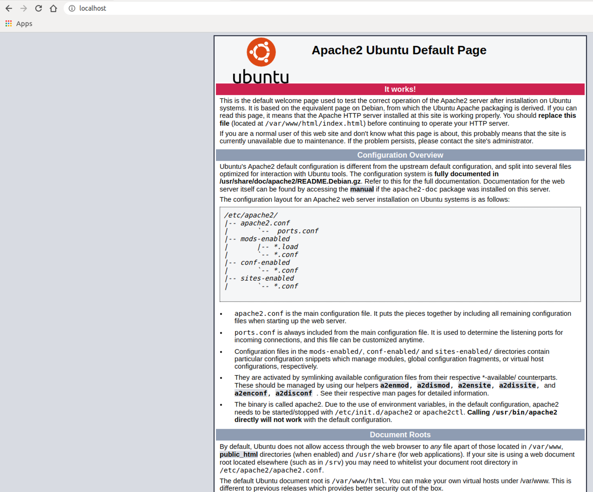

### Postfix

```bash
apt install postfix -y
```

1. Al momento de instalar `postfix` te saldran las siguientes opciones, selecciona la opcion `Internet Site` como se muestra en la imagen de abajo:

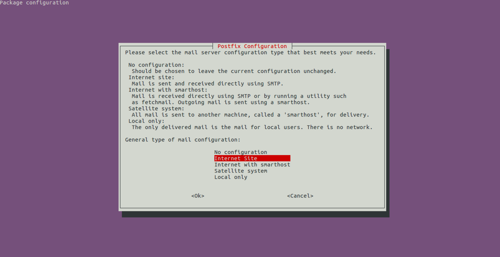

2. Seguido de esto deberas escribir un dominio para tus cuentas de correo, puedes ingresar el siguiente: **example.com**, como lo muestra la imagen de abajo:

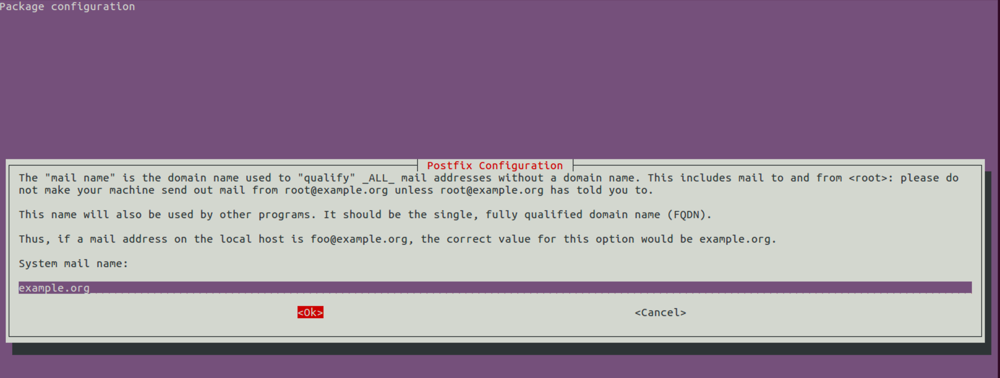

### Editar el archivo main.cf

Se tendra que editar el archivo llamado `main.cf` el cual es el archivo de configuracion de **Postfix** con el editor de texto para terminal `vim`.

Si no se encuentra familiarizado con este editor de texto, puede hacer click [aqui](https://www.hebergementwebs.com/vim-guia-rapida/article/458870) para ver una guia rapida del mismo.

```bash
vim /etc/postfix/main.cf
```

1. Se tendra que cambiar la siguiente linea

```text
inet_protocols = all
```

por ...

```text
inet_protocols = ipv4
```
 
2. Se tendra que agregar la siguiente linea al final del archivo

```text
home_mailbox = Maildir/
```

> Esta ultima linea sirve para crear el diretorio `Maildir` en el home de cada uno de los usuarios que se crearan mas adelante.
> Tu archivo `main.cf` se debera ver exactamente como la siguiente imagen:

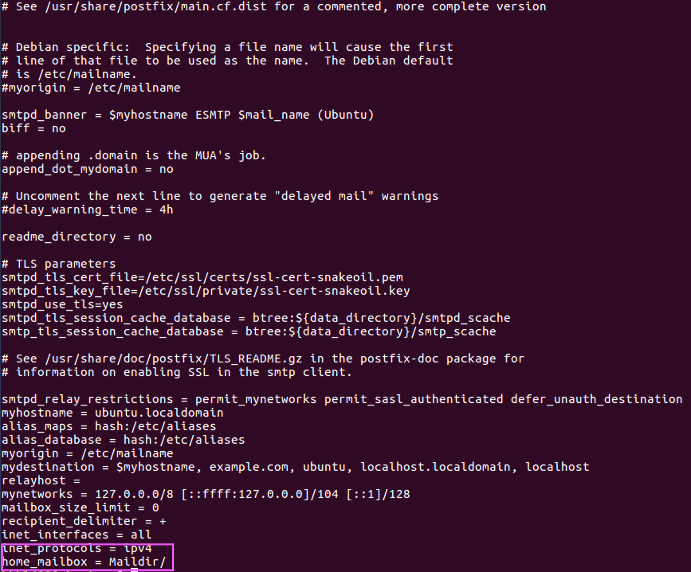


#### Reinciar servicio de Postfix

Se debera reiniciar el servicio de `postfix` para que los cambios surtan efecto en el sistema con el siguiete comando:

```bash
/etc/init.d/postfix restart
```

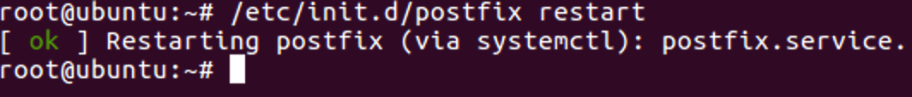

### courier-pop

Instalar el paquete `courier-pop`

```bash
apt install courier-pop -y
```

> Al momento de instalar este paquete les saldra la siguiete image, en la cual tienen que seleccionar la opcion `<No>` (que viene por defecto por cierto)

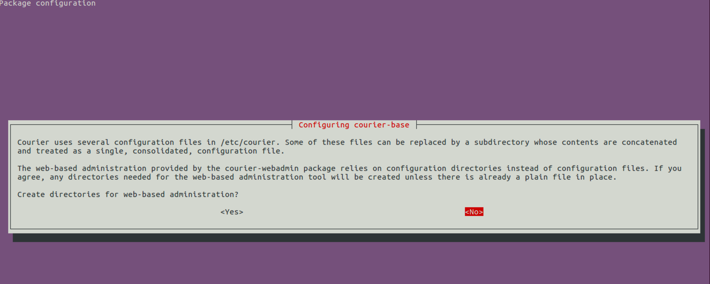

### courier-imap

Instalar el paquete `courier-imap`

```bash
apt install courier-imap -y
```

### squirrelmail

Instalar el paquete `squirrelmail`

```bash
apt install squirrelmail -y
```

### mailutils

Instalar el paquete `mailutils`

```bash
apt install mailutils -y
```

## Configurando courier daemon

Es necesario habilitar y reiniciar el servico de `courier` para que `squirrelmail` funcione sin problemas con los siguientes comandos:

```bash
systemctl enable courier-authdaemon
```

```bash
service courier-authdaemon restart
```


## Configurando squirrelmail

Ingresa el siguiente comando en terminal para abrir las opciones de configuracion de `squirrelmail`

```bash
squirrelmail-configure
```

1. Te aparecera el siguiente menu en el cual tendras que ingresar el caracter `D` **Set pre-defined settings for specific IMAP servers** y presionar enter:

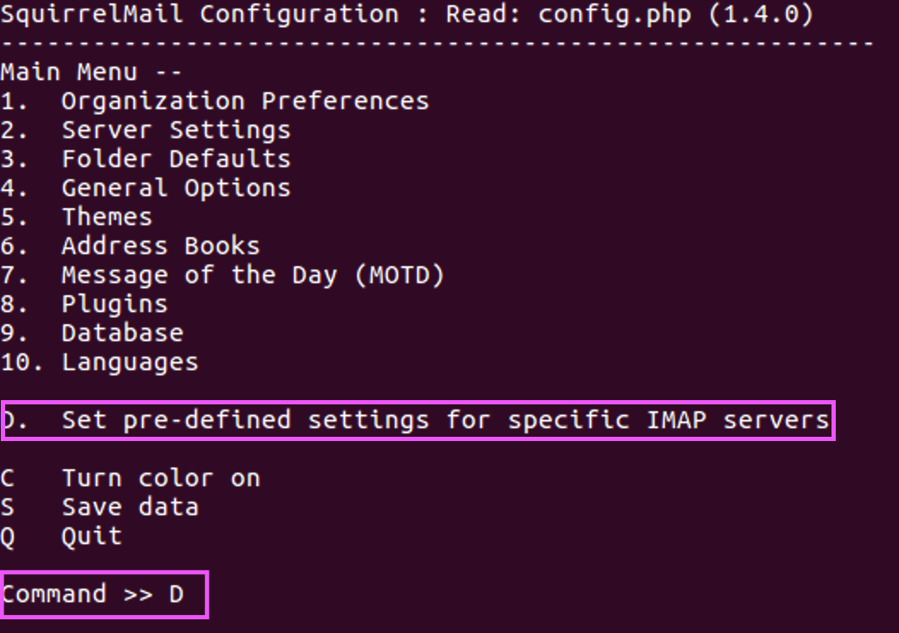

2. Ingresar la palabra `courier` y presiona enter: 

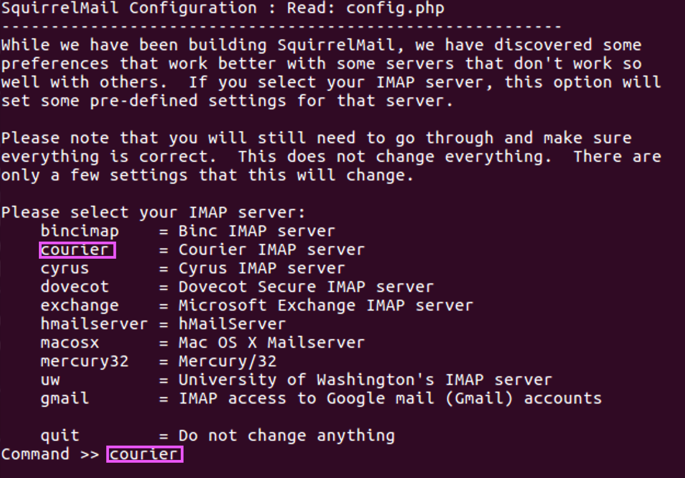

> Te tendra que salir exactamente las opciones de la siguiente imagen resaltadas en morado para poder continuar:

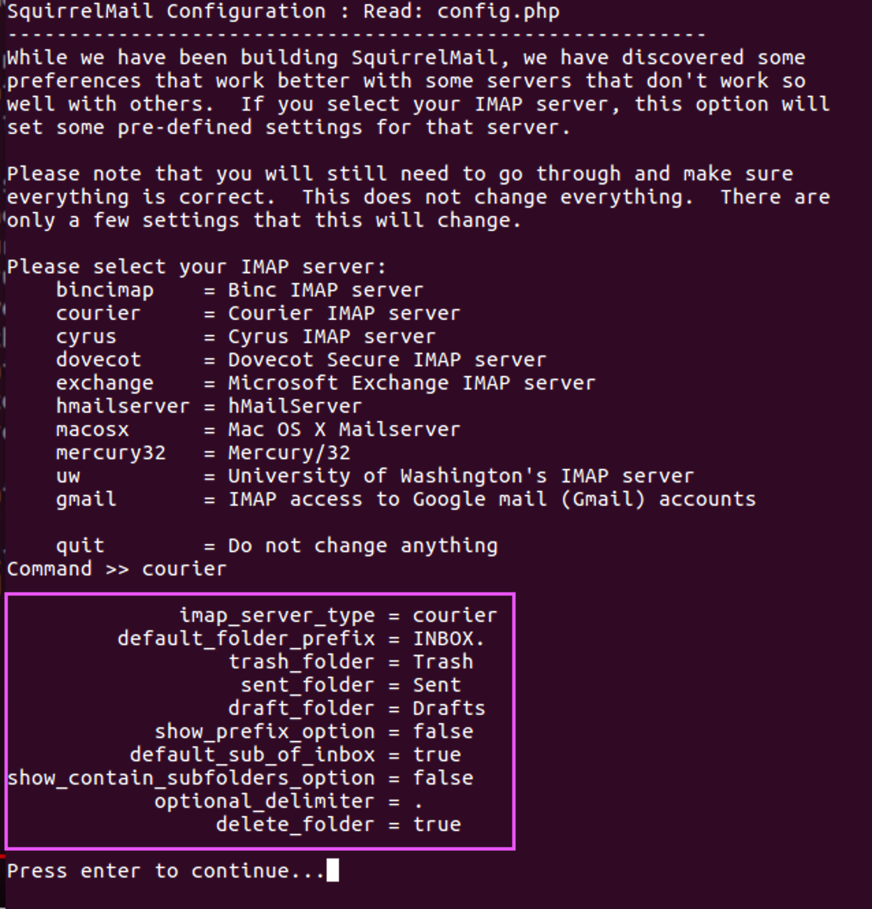

**Si todo esta correcto presiona enter para continuar**

3. Selecciona la opcion `2` **Server Settings**:

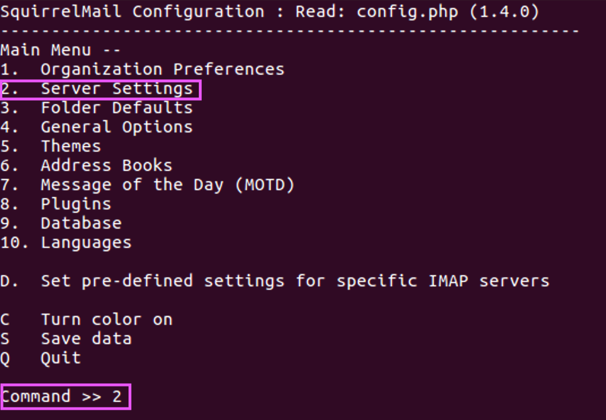


4. Selecciona la opcion `1` **Domain**

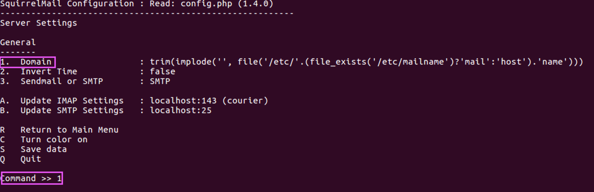

> Ingresa el mismo dominio ingresado en la seccion de `Postfix` en el paso 2, en esta guia es `example.com`

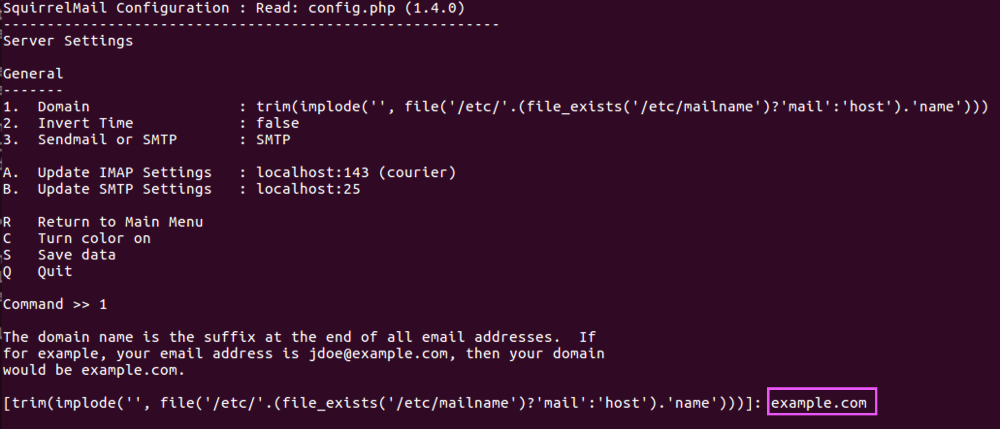

**Mucho cuidado ingresando el dominio, ya que si lo haces de manera erronea tendras que repetir todos los pasos en una instalacion fresca de Ubuntu**

Despues de ingresar presiona la tecla enter para setar el dominio ingresado.

5. Escribe la tecla `q` seguido de la tecla `y` para salir del menu de configuracion como lo muestra la siguiente imagen:

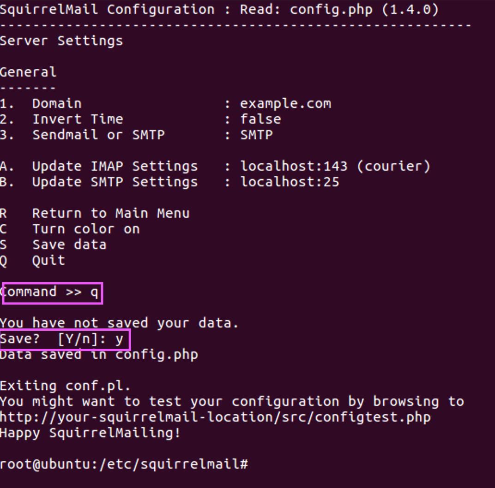


6. Crear link para squirrelmail

Se necesita tener una referencia a la carpeta de `squirrelmail` en la carpeta principal donde se instala apache para que el navegador reconozca los archivos **PHP** y de esta manera se pueda ingresar a la interfaz grafica.
Todo eso lo hacemos con el siguiente comando:

```bash
ln -s /usr/share/squirrelmail /var/www/webmail
```

## Configurando apache2

### Editar archivo de configuracion de apache2

```bash
vim /etc/apache2/sites-available/000-default.conf
```

1. Cambia la siguiente linea:

```text
DocumentRoot /var/www/html 
```

por esta:

```text
DocumentRoot /var/www
```

> El archivo `000-default.conf` debera quedarte exactamente igual al de la imagen a continuacion:

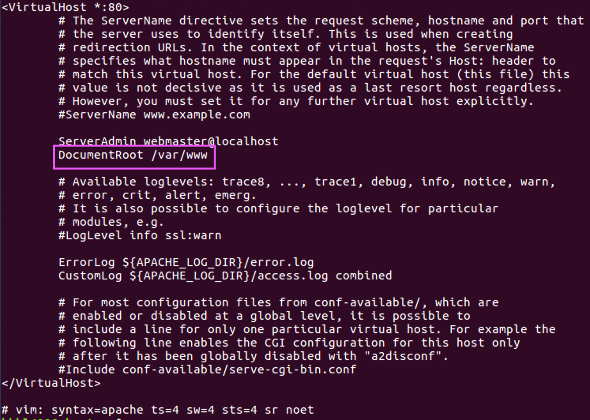


2. Reiniciamos el servidor de `apache2`

```bash
/etc/init.d/apache2 restart
```

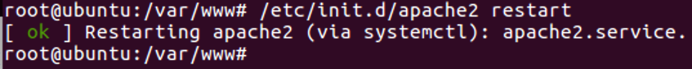


## Agregando usuarios al sistema

Para poder mandar correos a diferentes usuarios, estos necesitan estan creados en el sistema para poder realizar dicha accion.
Los cuales los podremos crear a travez de la linea de comandos siguiendo los pasos a continuacion:


```bash
adduser usuario1
```

> Cuando inserten la linea de comando anterior, les pedira que creen una contrasena para el usuario, la tendran que ingresar dos veces (esta no se vera por motivos de seguridad)
> Adicionalmente a eso solo es necesario ingresar en el campo `Full Name` algun nombre descriptivo para ese usuario, este campo es libre mas sin embargo recomiendo ingresar el mismo nombre que se uso para crear el usuario:
> Al final solo ingresan el caracter `y` para agregar al usuario al sistema

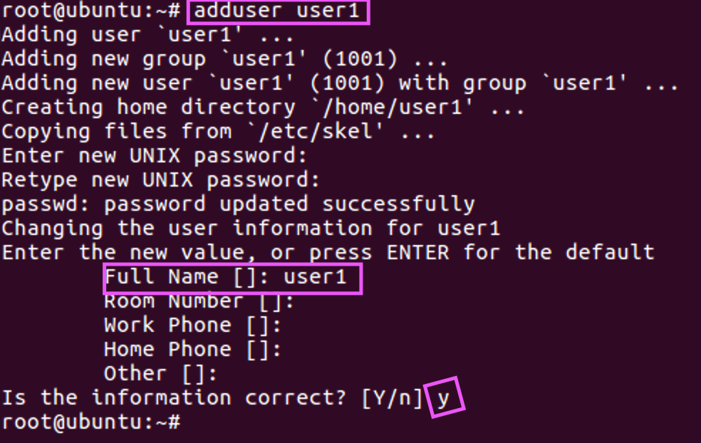

## Habilitando los usuarios para squirrelmail

`squirrelmail` necesita que todos los usuarios tengan el folder `Maildir` (el cual se configuro anteriomente en el archivo `main.cf.png` de postfix).
Esto para que en ese folder se guarden todos lo relacionado con los correos, si no se crea este folder no se podra iniciar sesion con el usuario en cuestion.

Ingresando los siguientes dos comandos, se creara dicho folder y se le daran los permisos necesarios:

```bash
sudo maildirmake /home/<TU_USUARIO>/Maildir
sudo chown -R <TU_USUARIO>.<TU_USUARIO> /home/<TU_USUARIO>/Maildir
```

> Remplazar `"<TU_USUARIO>"` por el usuario deseado, ejemplo:
> 
> `sudo maildirmake /home/usuario1/Maildir`
> `sudo chown -R usuario1.usuario1 /home/usuario1/Maildir`

# Ingresar a la intefaz grafica de squirrelmail

1. Abre un navegador e ingresa la siguiente URL: `localhost/webmail/src/login.php`

> La pagina que veras sera igual a la siguiente imagen:

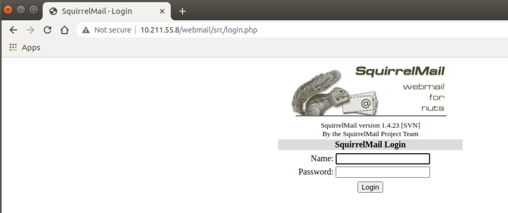


2. Ingresa un usuario y su contrasena para empezar a mandar correos, sigue el ejemplo del `gif` a continuacion:


