# Tabla de contenidos

- [Tabla de contenidos](#tabla-de-contenidos)
- [Projecto 2 - UTEG](#projecto-2---uteg)
- [Requerimientos de hardware](#requerimientos-de-hardware)
- [Requerimienos de software](#requerimienos-de-software)
  - [Sistema Operativo](#sistema-operativo)
  - [Script oficial](#script-oficial)
    - [Instalacion en la Raspberry](#instalacion-en-la-raspberry)
- [Instrucciones de ensamblado](#instrucciones-de-ensamblado)
  - [Conexion de la raspberry con el modulo de relay](#conexion-de-la-raspberry-con-el-modulo-de-relay)
  - [Conexion de la caja de contactos con el modulo de Relay](#conexion-de-la-caja-de-contactos-con-el-modulo-de-relay)
  - [Conexion de cualquier equipo en la caja de contactos](#conexion-de-cualquier-equipo-en-la-caja-de-contactos)
- [Encendiendo y apagando lo conectado a la caja de contactos](#encendiendo-y-apagando-lo-conectado-a-la-caja-de-contactos)
  - [Encender](#encender)
  - [Apagar](#apagar)
- [Alumnos](#alumnos)
- [Profesor](#profesor)

_______________________________________________
# Projecto 2 - UTEG

Este projecto trata de realizar una implementacion de `iOT` (Internet de las cosas) con productos que se pueden comprar a travez de tiendas online e incluso se pueden comprar directamente en las electronicas locales.

La implementacion aqui presentada se basara con la ayuda de una `Raspberry PI` el poder encender y apagar a travez de una conexion `SSH` o desde la misma interface de la `Raspberry` (Sistema Operativo) cualquier cosa que se conecte a una caja de contactos manejada a travez de una `Modulo de Relay de 4 canales`

Por ejemplo, aqui se conecto un reloj digital para su correcta manipulacion

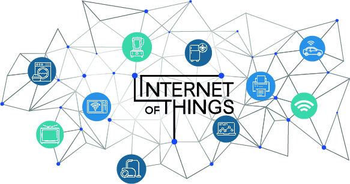

_______________________________________________
# Requerimientos de hardware

1 - Raspberry PI 3 modelo B o superior

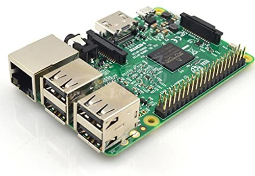


2 - Cables dupont jumper hembra-hembra 30 cm

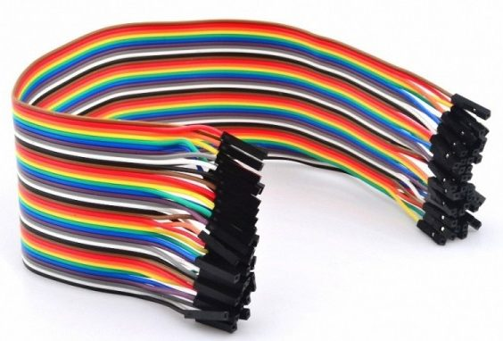


3 - Modulo de relay de 4 canales a 5v

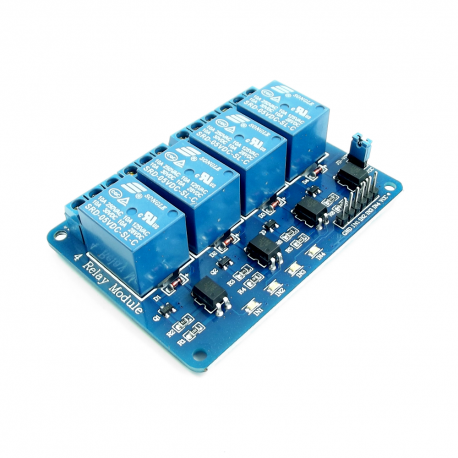

4 - Cable del polo #16

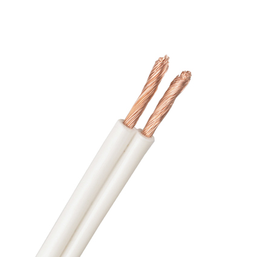

5 - Clavija

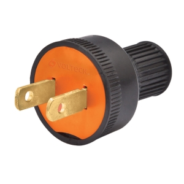

6 - Caja de contactos

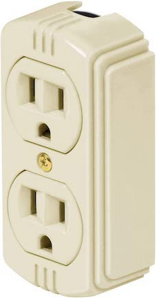

_______________________________________________
# Requerimienos de software

## Sistema Operativo

Descargar el sistema operativo oficial recomendado para la raspberry en el siguiente link de descarga:

[Raspberry oficial OS](https://www.raspberrypi.org/software/operating-systems)

> Nota: se recomienda instalar la version `Raspberry Pi OS with desktop and recommended software`

## Script oficial

Se creo un `script` especial para manejar este hardware el cual consiste en manipular los `GPIOs` de la raspberry.
La **Raspberry 3** tiene en total 8 `GPIOs` que podemos manejar, en esta ocacion solo usaremos 4 de ellos ya que el modelo de nuestro `modulo de relay` es de 4 canales.

### Instalacion en la Raspberry

1. Copiar o descargar el siguiente archivo en la `Raspberry`:

- [relayManager.sh](scripts/relayManager.sh)

2. Otorgar los permisos necesarios al script descargado:

```bash
chmod +x relayManager.sh
```

3. Crear un link simbolico del script hacia los binarios del sistema:

```bash
sudo ln -s relayManager.sh /usr/bin/relayManager
```

_______________________________________________
# Instrucciones de ensamblado

## Conexion de la raspberry con el modulo de relay

Una vez instalado el script en la `Raspberry`, correr el siguiente comando en terminal para mostrar la configuracion de los pines en ambos sentidos:

```bash
sudo relayManager -g
```

La salida del script sera la siguiente:

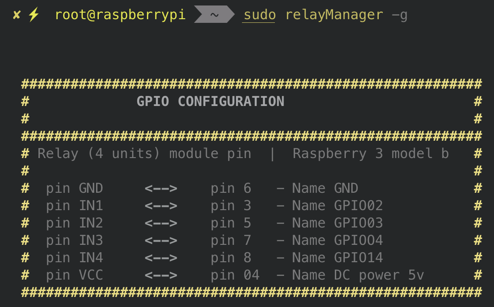


La cual podemos interpretar de manera muy clara como seran las conexiones entre el `Relay` de 4 canales con la `Raspberry`

Debera quedar de la siguiente manera la conexion:

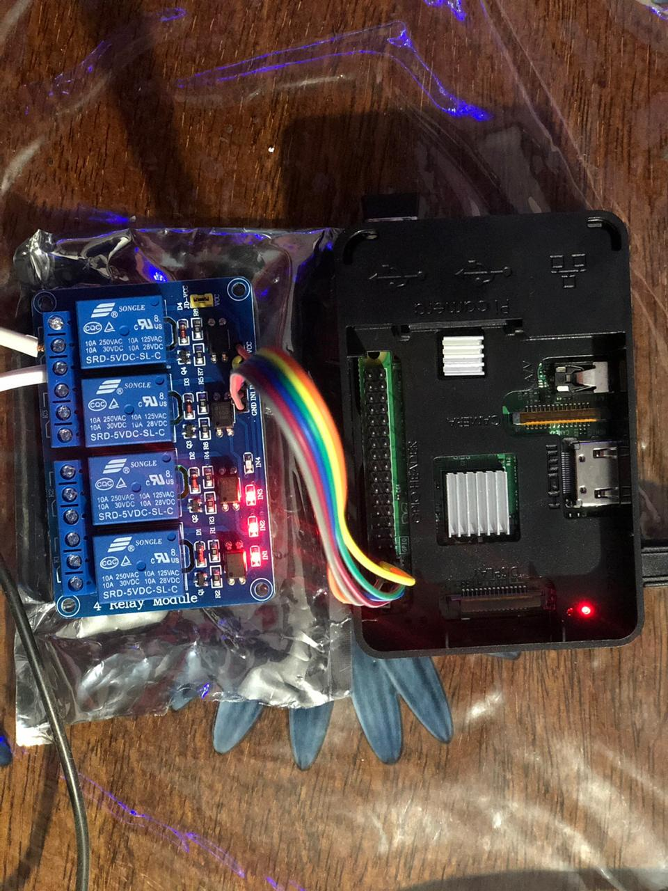


## Conexion de la caja de contactos con el modulo de Relay

1 - Se tiene que hacer una extension con la clavija y el cable del polo #16, como la siguiente imagen:
   
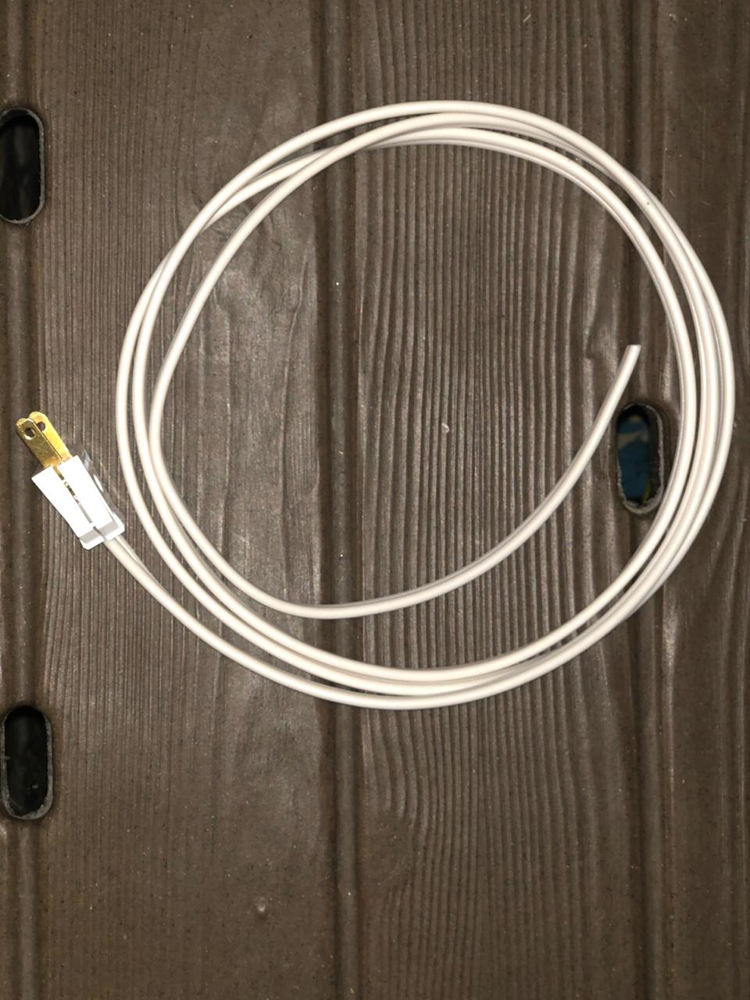

2 - La caja de contactos tiene una placa metalica la cual se tiene que cortar por la mitad para poder controlar dos de las 3 entradas que tiene.
3 - Conectar uno de las dos conexiones de la clavija en la caja de contactos

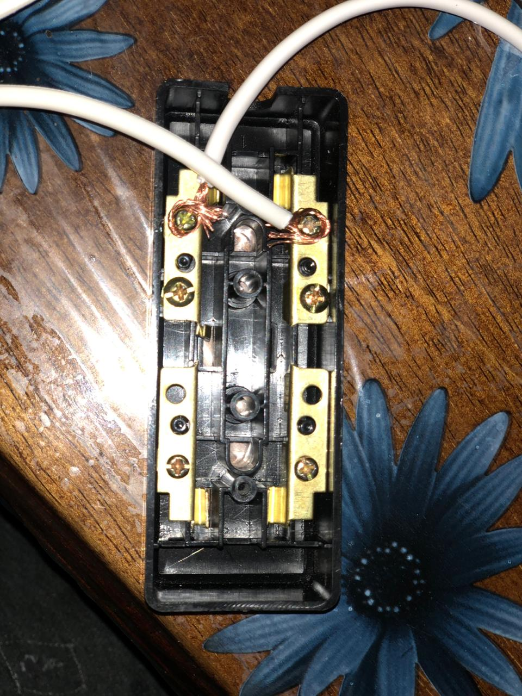

4 - Cortar un pedazo de cable del polo #16 para hacer una conexion de la caja de contactos hacia un relay
5 - Conectar el cable sobrante de la clavija al `Relay`

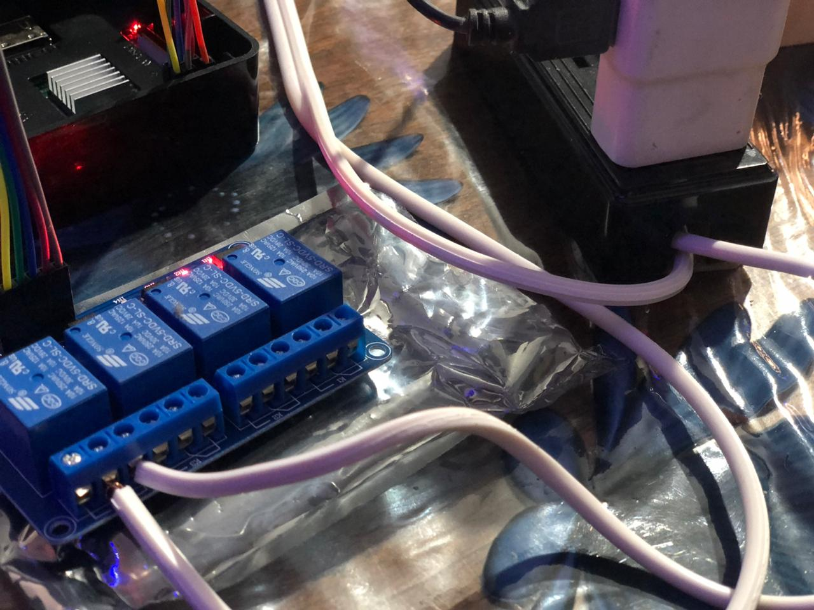


> Nota: usar las dos primeras entradas de cada `Relay`, la 3 entrada es GND

6 - Por ultimo conectar la clavija a un contacto de luz

## Conexion de cualquier equipo en la caja de contactos

En la caja de contactos se podra conectar cualquier aparato que se alimente de CA, como lo puede ser:

1. Una lampara
2. Un reloj
3. etc

En la imagen a continuacion se ilustra como conectar un reloj digital a la caja de contactos:

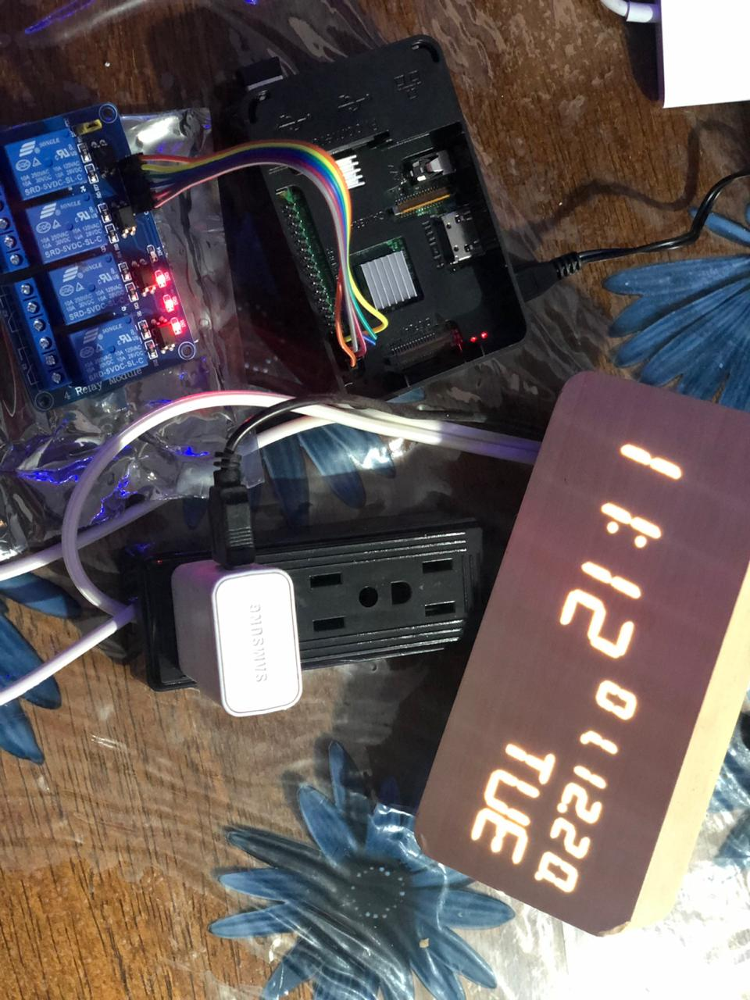

_______________________________________________
# Encendiendo y apagando lo conectado a la caja de contactos


## Encender

Para enceder el aparator que este conectado a la caja de contactos utilize el siguiente comando:

```bash
sudo relayManager -on <GPIO_PIN>
```

Ejemplo:

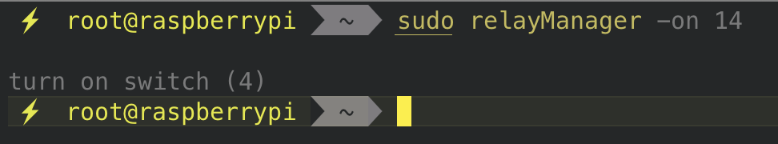


## Apagar


Para apagar el aparator que este conectado a la caja de contactos utilize el siguiente comando:

```bash
sudo relayManager -off <GPIO_PIN>
```

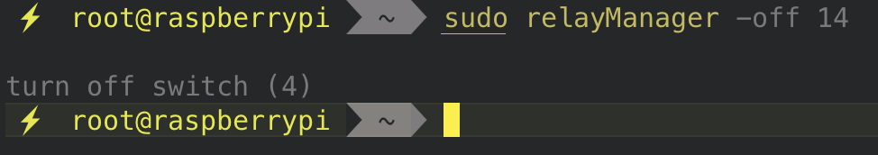

_______________________________________________
# Alumnos

- Humberto Israel Perez Rodriguez
- Victor Hugo Robles Aguayo
- Juan Carlos Navarro Borunda

_______________________________________________
# Profesor

- Edgar Arturo Enrique Lopez